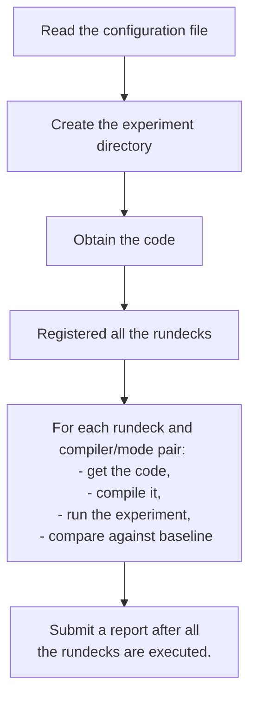

# GISS modelE Regression Testing                                                                      
  
We describe the current settings to perform
the daily modelE regress tests. 
    
All the scripts and source code files are in
the GISS project directory on discover:
 
```
   /discover/nobackup/projects/giss_ana
```


## Location of the Python scripts
 
The scripts are in:
 
```
   /discover/nobackup/projects/giss_ana/regression/modelE_tools/RegressionTests
```
 
Some of the files were edited after the tool was obtained from the repository. One notable file that was added is:
  
``` 
   mailingList
``` 
 
It has the email addresses of the users expected to receive the regression test report.

## Basic worklow
Here is how the regression testing tool works.


 
## Location of the modelE branches
 
We are interested in the following branches:
 
1. `E2.1_branch`
2. `E2.1_branch_traps`
3. `E2.1_lakes_slsm` 
4. `E2.1_slsm`
5. `E2.2_merge`
6. `planet`
7. `planet_1.0`
8. `tracersE3`
9. `tracersE3_traps`
 
In the folder:
 
```
   /discover/nobackup/projects/giss_ana/regression/branch_repos
```
 
There is the script, `clone_modelE_branches.py`,
that is used to get the source code for all the above branches.
 
After all the above branches are cloned (using the script),
it is important to edit (in each of their source directory)
the model configuration file (ending with the suffix `.cfg`) in the folder:
 
```
   exec/testing/
```
 
It is necessary to provide the full paths to the source files and to the regression scripts. You may want also to provide the email address of the regression tester. It is this configuration file that will used for the regression test.
 
## Automated regression tests with Cron job
 
You first need to connect to the appropriate discover node:
 
```
   ssh discover-cron
```
 
When you are there, issue the command:
 
```
   crontab -e
```
 
that creates a vim editor where you can type the two lines
(not that we need to provide the full path to the location
of the scripts):
 
```
1 1 * * * (. /etc/profile; ssh discover-mil /discover/nobackup/projects/giss_ana/regression/modelE_tools/RegressionTests/reg_tests.sh )
2 4 * * 6 (. /etc/profile; ssh discover-mil /discover/nobackup/projects/giss_ana/regression/modelE_tools/RegressionTests/reg_traps.sh )
```
 
The `reg_tests.sh` (first line) Shell script is run every night,
and will check if any of the tested branches (five of them) have
been modified in the past 24 hours.
The `reg_traps.sh` (second line) Shell script is run every Saturday
on branches that which names end with the word `traps` (two of them).
 
Regression tests are only run on modified branches.
The tested branches are checked against Git repositories under this directory:
 
```
   /discover/nobackup/projects/giss_ana/regression/branch_repos
```
 
If a branch of the code has been modified,
that branch will be cloned to this scratch directory:
 
```
   /discover/nobackup/projects/giss_ana/regression/branch_repos/<branch_name>
```
 
where it is built and then run with specified rundecks
for that branch.
The set of rundecks to be tested is defined in the `*.cfg` file
under `exec/testing` subfolder of the above directory.
 
After running, the output is checked against the
baseline under this directory:
 
```
   /discover/nobackup/modele/modelE_baseline
```
 
The results of all tests are compiled into a report,
which is then emailed to the address set by
the setting of the `mailto` parameter in the config (`*.cfg`) file.
If there is a file named `mailingList` in this scripts directory,
the report will also be sent to each address listed in the file.
The `mailingList` file must contain one email address per line.
For privacy reasons, this file is not committed to the repository.
 
## Manual regression tests
 
These tests are similar to the automated tests,
but can be executed from the command line.
The scripts' functionality is specified by your config file.
This scripts' directory has a sample config file called
`foo.cfg` that can be copied and then modified to set up your
own customized test.
The file can have any name, but must end in `.cfg`.
The config file is a human-readable text file with
a particular structure that can be handled by the Python
`ConfigParser` module.
 
Config files are organized into 3 sections,
which contain name-value pairs for configuration data.
 
- `[USERCONFIG]`: contains more that 16 parameters
    for users' related settings.
- List of rundecks specified by the user.
    Each rundeck has its own section appearing as
    `[rundeck_name]`.
- `[COMPCONFIG]`: It is meant to set the compiler selections
    and the paths to external libraries.
    This is mainly contained in the file
    `comp.cfg` to give more flexibilty in chosing
    compilers in different computing environments.
 
The Python code has an internal mechanism to automatically
convert the configuration files (with the `.cfg` suffix)
into one YAML file.
The new file is then read in to create a dictionary
that has three main sections (keys):
- `USERCONFIG`
- `COMPCONFIG`
- `RUNDECKS`: all the rundecks (and their settings) are
    listed here.
 
We added this conversion to modernize the Python code
(by simplifying function interfaces)
without disrupting the use of the tool.
 
After customizing your config file (i.e., `my_modelE_config.cfg`),
you can submit (on NCCS `discover` the regression test
using the commands (from the location where the regression
scripts reside):
 
```
   module load python/GEOSpyD/Min23.5.2-0_py3.11
   python reg my_modelE_config &
```
 
__Note that the `.cfg` extension should not be included in the last command.__
 
A report will show if the code was successfully compiled,
and check output reproducibility.
It will check for differences against the baseline output
(at `/discover/nobackup/modele/modelE_baseline`) and betweeen
__1hr__ and __25hr__ runs.
The report will be sent to the email specified by `mailto` in
your config file.
 
Run-time output files(`fort.1.nc`, `*.PRT`, etc.) will be written to:
 
```
<scratchdir>/scratch/<repobranch>/savedisk/<rundeck>.<mode>.<compiler>/*
```
where `<bracketed>` parameters are defined in your configuration
file.  For example:
 
```
   $NOBACKUP/my_modele_out/scratch/planet_1.0/savedisk/E_Mars.serial.intel/
```
Makefile logs and other script outputs will be written to:
 
```
<scratchdir>/results/<repobranch>/<compiler>
```
 
For example:
```
   $NOBACKUP/my_modele_out/results/planet_1.0/intel/
```

## Conditional testing based on rundeck dependencies
 
The goal is to cut down on wasted compute cycles,
by preventing rundeck runs from starting that are similar
to other rundeck runs that have aborted.
It will allow setting some rundecks to be dependent on the
successful completion of other rundecks,
so the dependent "child" runs will remain in a pending
state until SLURM detects success of its "parent" rundeck.
 
It works by first running all the rundecks that have no dependencies,
and gathering the SLURM jobID from each of them.
Then the dependent runs are submitted using SLURM's `--dependency`
option:
 
```
sbatch --dependency=afterok:<jobID_1>:<jobID_2>[:etc] /path/to/rundeck_jobscript
```
It will read the rundeck `dependencies` settings from
the regression configuration file (i.e., `planet_1.0.cfg`)
using the format in this example:
 
```
[PS_Mars]
dependencies=none
compilers=intel,gfortran
modes=serial,mpi
npes=1,4
verification=restartRun
 
[P4SM40]
dependencies=PS_Mars
compilers=intel,gfortran
modes=serial,mpi
npes=1,8
verification=restartRun
 
[P1oM40]
compilers=intel,gfortran
modes=serial,mpi
npes=1,8
verification=restartRun
 
[P1SoM40]
dependencies=P1oM40,PS_Mars
compilers=intel,gfortran
modes=serial,mpi
npes=1,8
verification=restartRun
```
 
In this example, the run decks `PS_Mars` and `P1oM40` have no dependencies
(if a rundeck's dependencies setting is omitted, it defaults to 'none').
`P4SM40` will only run if `PS_Mars` completes successfully.
`P1SoM40` will only run if both `P1oM40` and `PS_Mars` run
till completion.
 
There are normally 4 runs of each rundeck due to different
compilers/modes, and the code will differentiate between them.
If a rundeck only fails when using gfortran in mpi mode,
dependent runs will only be canceled if they also use
gfortran in mpi mode.
The list of dependencies will be shown in the emailed test report,
so it's fairly easy to tell which dependent runs will not show up
in the report when their dependency job fails.
 
Note that the current code only supports one dependency layer,
so if rundeck dependency settings are daisy-chained
(`A` depends on `B`, which depends on `C`),
the script will abort with an error message before
submitting anything.
